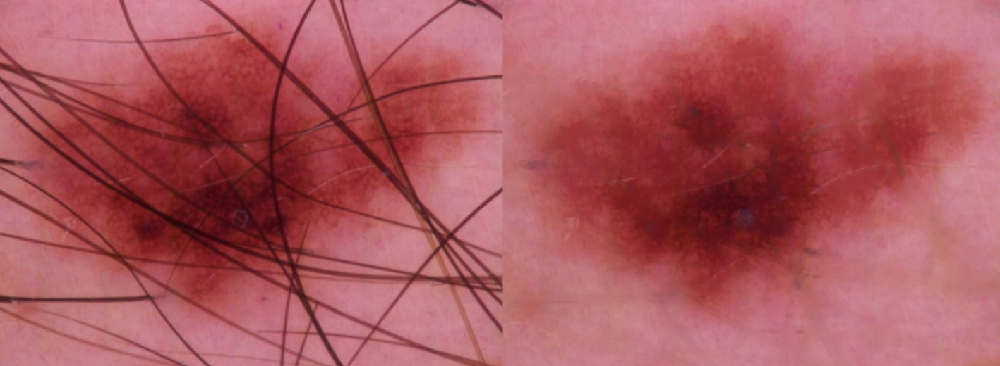
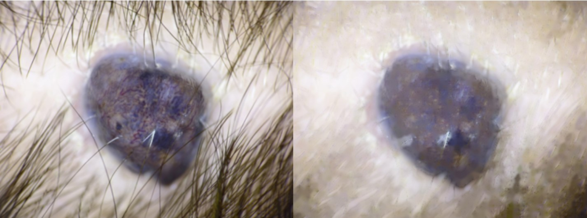

# Projects in Data Science (2025)

# Summary of Hair Segmentation in Skin Lesion Images

## Background  
Medical imaging plays a crucial role in analyzing skin lesions. However, hair in images can obstruct important details, potentially affecting diagnosis and further classification. This project focuses on segmenting and removing hair from skin lesion images to improve their clarity.  

## Data Exploration and Annotation  
The dataset consists of high-quality lesion images, each manually annotated by five group members for hair presence using the following scale:  

- **0**: No hair  
- **1**: Some hair  
- **2**: A lot of hair  

Most annotations were consistent across group members. However, in some cases, there were minor disagreements, particularly between **"no hair" and "some hair"**, as well as between **"some hair" and "a lot of hair."** These annotations were stored in a CSV file following the provided template.  

## Hair Segmentation Method  
Hair removal was implemented using the following steps:  

1. **BlackHat Filtering** – Enhances dark hair structures against a bright background.  
2. **Thresholding** – Creates a binary mask to detect hair regions.  
3. **Inpainting** – Removes detected hair and fills gaps using surrounding pixels.  

The `removeHair()` function from `inpaint_util` was used to perform these operations. The pipeline was applied to all images using the `ImageDataLoader` class.  

## Observations and Results  
To evaluate the effectiveness of hair removal, we experimented with different kernel sizes:  

- **Smaller kernel (e.g., 5×5)**: Hair was not always completely removed from the image.  
- **Larger kernel (e.g., 25×25)**: Hair removal was more effective, but some lesion details were lost as a tradeoff.  

### Example of Successful Hair Removal  
The algorithm performed well in this case. Despite the presence of significant hair, it was effectively removed while preserving lesion details.  

*(Left image: Before applying algorithm, Right: After applying algorithm (kernel size = 25))*  

### Example of Poor Performance  
In this case, the algorithm did not perform as expected. The output appears questionable, with excessive detail loss in the lesion area.  

*(Left image: Before applying algorithm, Right: After applying algorithm (kernel size = 25))*  

## Conclusion  
The hair segmentation method effectively improves lesion visibility by removing occluding hair. However, factors like the choice of kernel size impact performance, balancing between complete hair removal and preserving lesion details.  

